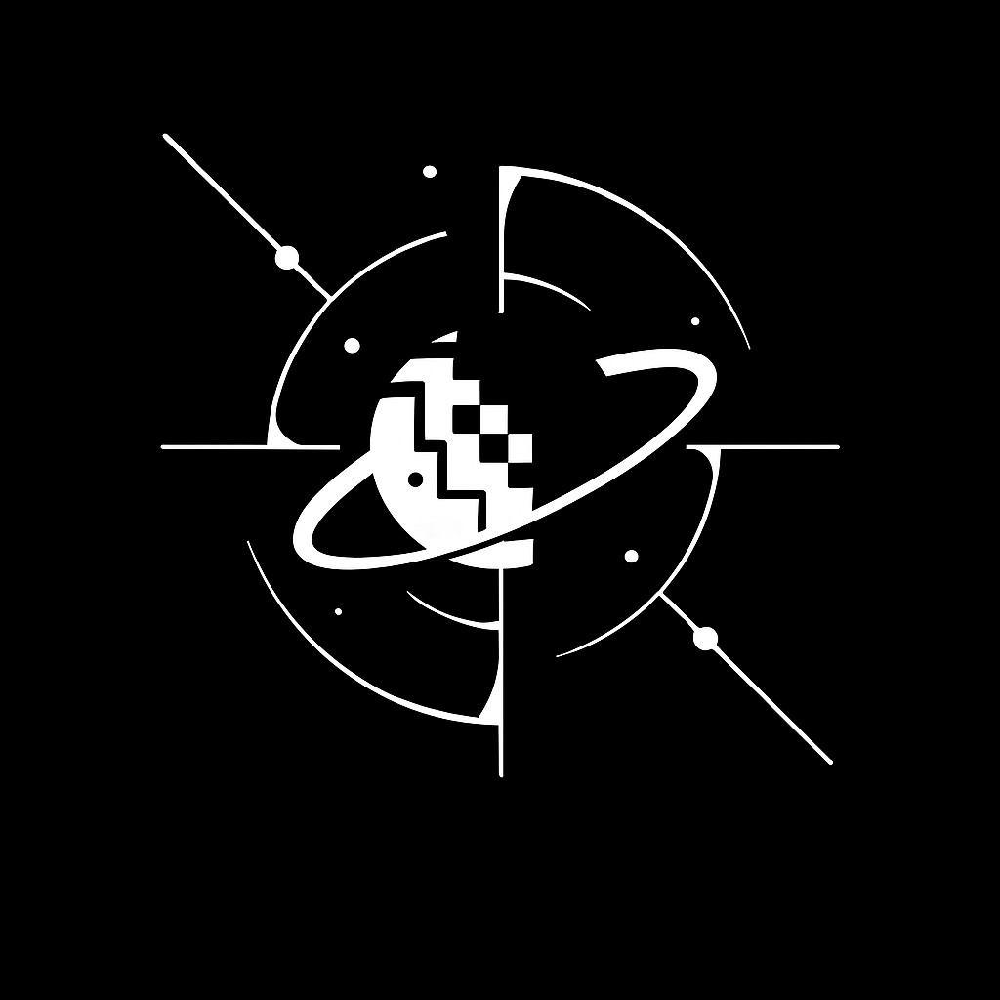

# 团队介绍

| 这个作业属于哪个课程 | https://edu.cnblogs.com/campus/fzu/202501SoftwareEngineering                |
| -------------------- | --------------------------------------------------------------------------- |
| 这个作业要求在哪里   | https://edu.cnblogs.com/campus/fzu/202501SoftwareEngineering/homework/13546 |
| 这个作业的目标       | 完成组队; 撰写博客                                                          |

---

---

## 1. 团队 LOGO

↓↓↓↓ 下面是**项目 logo** ↓↓↓↓

## 2. 团队名称

我们团队的名称是

**以太校园！！**

**以太校园！！**

**以太校园！！**

> 我们致力于让每一次信息交互都高效省心，让每一份校园资源都精准对接，持续提升信息流动的效率与质量。未来，我们将继续深耕校园场景，聚力构建更智能、更可信的校园生态，让科技真正融入日常，为学生们的校园生活注入更多便捷与温暖。

---

## 3. 项目描述

- 选题背景与研究意义

  > 随着校园信息化与人工智能技术的快速发展，大学校园中学生的学习、生活与社交需求日益多样化和碎片化。二手交易、代拿互助、拼车找搭子、校园墙交流等需求，往往分散在微信群、QQ群、小程序和匿名平台中，造成**信息割裂、检索困难、匹配效率低下与信任机制薄弱**等突出问题。
  >
  > 传统的校园论坛或“表白墙”类平台，以**信息展示与讨论**为核心，缺乏**任务撮合与风险控制**机制，无法实现需求的完整闭环。与此同时，多智能体（Multi-Agent）技术的发展，使得“自动分类、智能审核、个性化推荐”成为可能，为校园信息平台提供了新的智能化解决思路。
  >
  > 基于此，本课题拟设计并实现一个**多智能体驱动的校园信息整合平台——AetherNet（以太校园）**，通过智能审核、语义匹配与任务撮合机制，构建可信、高效、自治的校园互助生态系统。
  >
  > 本研究的意义体现在以下三个方面：
  >
  > 1. **现实意义**：缓解学生信息分散与信任缺口问题，构建校园内的高效互助网络；
  > 2. **技术意义**：探索多智能体技术在小型社交与服务系统中的实际落地路径；
  > 3. **社会意义**：促进校园经济循环与共享文化，提升高校信息生态与安全治理水平。

  ---

  

- 预期成果

  > 1. 一套可运行的校园互助系统（Web MVP + 小程序原型；
  > 2. 完整的系统需求说明书（SRS）与 OpenAPI 文档；
  > 3. 多智能体协同算法与审核撮合机制原型；
  > 4. 校园级数据安全与追责机制方案。

  ---

  

- 创新点

|    方向    |                      创新内容                      |
| :--------: | :------------------------------------------------: |
|  体系架构  |  引入多智能体模块化架构，实现自治协作与多功能联动  |
| 智能化能力 |  结合语义检索与规则引擎，实现自动审核与个性化撮合  |
|  用户机制  |           构建“匿名可追责”的双层身份体系           |
|  跨端架构  |      实现 Web、小程序、App 三端统一数据与接口      |
|  应用场景  | 打造面向校园的“需求撮合+任务互助+内容风控”闭环生态 |

---

- 研究计划与进度安排

| 周次  |    阶段     |               主要任务               |       预期成果        |
| :---: | :---------: | :----------------------------------: | :-------------------: |
| W1-W2 |  需求分析   | 完成需求冻结、系统原型图与数据库设计 |    原型与需求文档     |
| W3-W4 | Web MVP开发 |   实现发帖、审核、撮合、私聊主流程   |   Web MVP可演示版本   |
|  W5   | 小程序迁移  |        适配微信登录与推送机制        |    微信小程序原型     |
|  W6   |  校园测试   |   收集用户反馈与性能数据、优化算法   |     校园内测报告      |
| 后期  |  App 演进   |        开发推送系统与原生接口        | App Alpha版与扩展报告 |

---

## 4. 队员风采

<table border="1" cellpadding="10" cellspacing="0" style="border-collapse: collapse; width: 100%;">
    <tbody>
        <tr>
            <th colspan="3" style="text-align: center; background-color: #e6f7ff; font-size: 18px;">队长介绍</th>
        </tr>
        <tr>
            <td style="width: 33%; padding: 10px; text-align: center;">
                

                    
                    
刘琦晟

                    
102301227

                    
INFJ

                    
组长

                

            </td>
            <td style="width: 33%; padding: 10px; text-align: center;">
                
“也许有一天我也成为全栈大佬”

            </td>
            <td style="width: 33%; padding: 10px; background-color: #99d9f4; color: black; text-align: center;">
                
全能型组长，擅长Vue，致力于我组后端 UI 的开发，对于打游戏、睡觉、旅游、摄影方面有着独到见解。

            </td>
        </tr>
    </tbody>
</table>

<table border="1" cellpadding="10" cellspacing="0" style="border-collapse: collapse; width: 100%;">
    <tbody>
        <tr>
            <th colspan="3" style="text-align: center; background-color: #e6f7ff; font-size: 18px;">队员介绍</th>
        </tr>
        <tr>
            <td style="width: 33%; padding: 10px; text-align: center;">
                

                    
                    
陈泽荣

                    
102301438

                    
ESFJ

                

            </td>
            <td style="width: 33%; padding: 10px; text-align: center;">
                
“干巴爹&”

            </td>
            <td style="width: 33%; padding: 10px; background-color: #99d9f4; color: black; text-align: center;">
                
有前端设计经验，可在前端、UI 或其他灵活分配的岗位工作，游戏爱好培养了交互的敏感性，丰富的经验能确保使其能出色完成。

            </td>
        </tr>
        <tr>
            <td style="width: 33%; padding: 10px; text-align: center;">
                

                    
                    
赵鑫鑫

                    
102301512

                    
LMIS

                

            </td>
            <td style="width: 33%; padding: 10px; text-align: center;">
                
“干就完了”

            </td>
            <td style="width: 33%; padding: 10px; background-color: #99d9f4; color: black; text-align: center;">
                
期望成为后端开发工程师，以沉稳的态度投入到后端开发工作中，在休息好的状态下高效地完成代码编写和系统搭建任务。

            </td>
        </tr>
        <tr>
            <td style="width: 33%; padding: 10px; text-align: center;">
                

                    
                    
王心宏

                    
102301522

                    
ESFP

                

            </td>
            <td style="width: 33%; padding: 10px; text-align: center;">
                
“跟对人，走对路，做对事。”

            </td>
            <td style="width: 33%; padding: 10px; background-color: #99d9f4; color: black; text-align: center;">
                
擅长 Python 数据科学栈、Java 后端开发及算法，倾向后端工作，运动和音乐爱好让其保持良好的身心状态，提供稳定的技术支持。

            </td>
        </tr>
        <tr>
            <td style="width: 33%; padding: 10px; text-align: center;">
                

                    
                    
李帅

                    
172309011

                    
ESTJ

                

            </td>
            <td style="width: 33%; padding: 10px; text-align: center;">
                
“感谢”

            </td>
            <td style="width: 33%; padding: 10px; background-color: #99d9f4; color: black; text-align: center;">
                
熟悉 java 后端技术，从事后端开发，爱好音乐使其在音乐熏陶下在编程时更具创造力和耐心，不断优化后端代码和功能。

            </td>
        </tr>
        <tr>
            <td style="width: 33%; padding: 10px; text-align: center;">
                

                    
                    
李玥彤

                    
102301106

                    
ESFP

                

            </td>
            <td style="width: 33%; padding: 10px; text-align: center;">
                
“以赤子之心探未知之境，用恒久之志开未来之局。”

            </td>
            <td style="width: 33%; padding: 10px; background-color: #99d9f4; color: black; text-align: center;">
                
擅长 HTML、CSS、JavaScript 技术，专注于前端开发，平常爱好看电影，在电影的熏陶下，能更好地把握色彩搭配、页面布局。

            </td>
        </tr>
        <tr>
            <td style="width: 33%; padding: 10px; text-align: center;">
                

                    
                    
贺之梅

                    
102301108

                    
INFJ

                

            </td>
            <td style="width: 33%; padding: 10px; text-align: center;">
                
“明白自己在学习上还需要更多的主动性和耐心，技术成长是一个持续积累的过程。”

            </td>
            <td style="width: 33%; padding: 10px; background-color: #99d9f4; color: black; text-align: center;">
                
熟练掌握 C、C++ 编程语言，投身于前端开发工作。在阅读中积累知识、从电影里获取灵感，都巧妙地融入到前端开发中。

            </td>
        </tr>
        <tr>
            <td style="width: 33%; padding: 10px; text-align: center;">
                

                    
                    
俞欢殷

                    
102301303

                    
ISTP

                

            </td>
            <td style="width: 33%; padding: 10px; text-align: center;">
                
“十分荣幸参与这个项目”

            </td>
            <td style="width: 33%; padding: 10px; background-color: #99d9f4; color: black; text-align: center;">
                
拥有潜水这项独特技能，热衷于羽毛球、画画和音乐，致力成为一名好组员，凭借其特殊技能，为团队带来创新的视角和积极氛围。

            </td>
        </tr>
        <tr>
            <td style="width: 33%; padding: 10px; text-align: center;">
                

                    
                    
丁浚哲

                    
102301437

                    
INFJ

                

            </td>
            <td style="width: 33%; padding: 10px; text-align: center;">
                
“纳尼纳尼，怎怎瓦嘎乃。”

            </td>
            <td style="width: 33%; padding: 10px; background-color: #99d9f4; color: black; text-align: center;">
                
擅长平面设计，希望负责前端工作，对明日方舟的热爱使其更了解年轻用户的喜好，能够将这种理解融入到前端平面设计中。

            </td>
        </tr>
        <tr>
            <td style="width: 33%; padding: 10px; text-align: center;">
                

                    
                    
孙其煜

                    
052201142

                    
INFP

                

            </td>
            <td style="width: 33%; padding: 10px; text-align: center;">
                
“代码如诗，逻辑如画。在0与1的世界里，每一次调试都是与真理的对话。”

            </td>
            <td style="width: 33%; padding: 10px; background-color: #99d9f4; color: black; text-align: center;">
                
具备全能的技术能力，致力于前端开发工作，在打游戏的过程中或许能获取独特的设计灵感，助力打造更具交互性的前端界面。

            </td>
        </tr>
        <tr>
            <td style="width: 33%; padding: 10px; text-align: center;">
                

                    
                    
张君锋

                    
052204124

                    
ENTJ

                

            </td>
            <td style="width: 33%; padding: 10px; text-align: center;">
                
“希望自己能够尽一份力，从中能够学到一些内容。”

            </td>
            <td style="width: 33%; padding: 10px; background-color: #99d9f4; color: black; text-align: center;">
                
拥有量化方面的专长，全能型组员，无论是何种岗位都能积极适应，凭借自身对健身的热情，能为项目带来不一样的活力。

            </td>
        </tr>
        <tr>
            <td style="width: 33%; padding: 10px; text-align: center;">
                

                    
                    
卢铃颖

                    
102301105

                    
ENFP

                

            </td>
            <td style="width: 33%; padding: 10px; text-align: center;">
                
“行百里者半九十”

            </td>
            <td style="width: 33%; padding: 10px; background-color: #99d9f4; color: black; text-align: center;">
                
掌握 Python、C / C++ 技术，渴望尝试不同软工角色，丰富的兴趣让其思维开阔，能为项目带来多元化的解决方案。

            </td>
        </tr>
    </tbody>
</table>

​        

